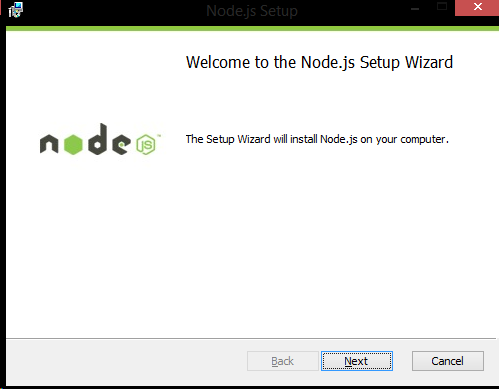
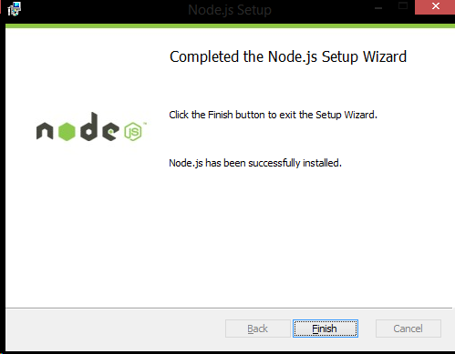
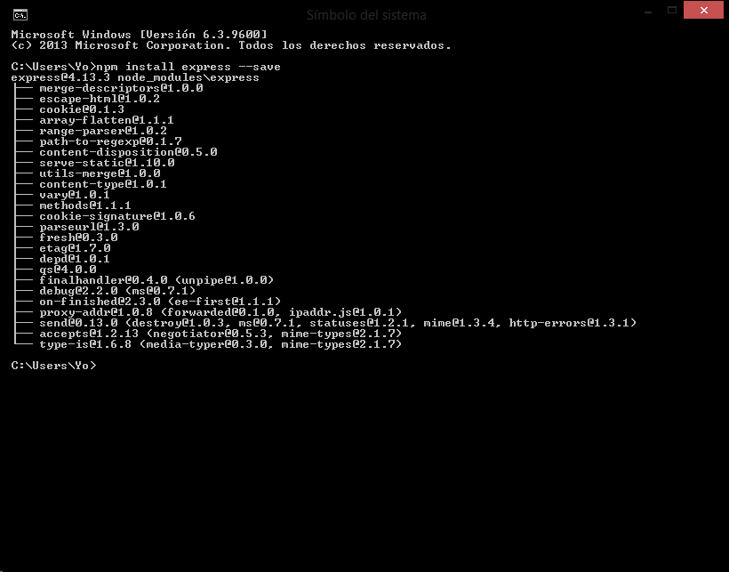
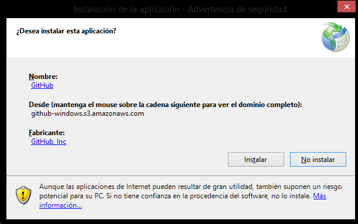
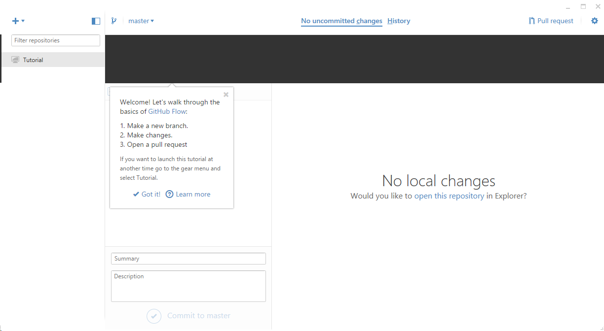
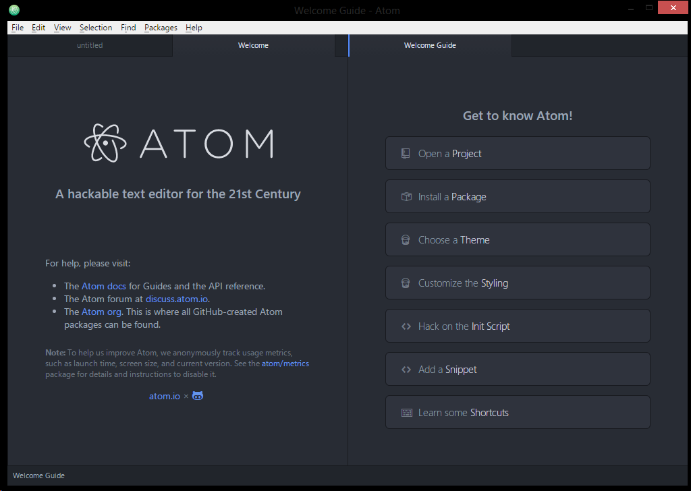
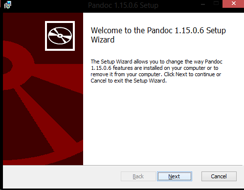

# **SISTEMAS Y TECNOLOGIAS WEB**

### **Node.js**

Lo primero es instalar node.js en windows para lo que utilizamos su instalador:

Y seguimos con los pasos de la instalación hasta el final:

### **Express**

Instalamos el framework Express desde la linea de comandos

### **Github**

Instalamos Github app para windows mediante el instalador

Quedando de la siguiente manera

### **Atom**

Instalamos Atom como editor de textos

### **Pandoc**

Por ultimo instalamos Pandoc para traducir de marckdown a html

